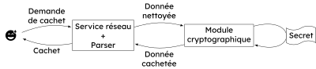

- Séparer les fonctionnalités d'une application
- Isoler des actions potentielles dangereuses
- Limiter les privilèges requis (ports privilégiés...)
- Garder les secrets... secrets

 

**Exemple** : service de cachet serveur

<aside class="notes">

Dans l'exemple proposé, le service réseau (HTTP) assure la fonction de *parser*
sur les entrées utilisateurs. Cette opération est risquée et constitue un
vecteur fréquents de vulnérabilités.

À l'autre bout de la chaîne, le service cryptographique manipule un secret qui doit
impérativement le rester sous peine de compromettre toute l'intérêt de l'application.

</aside>
